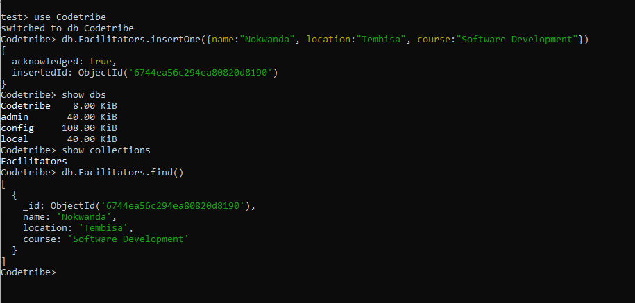
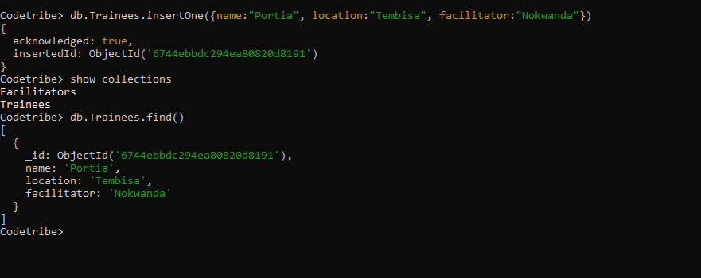
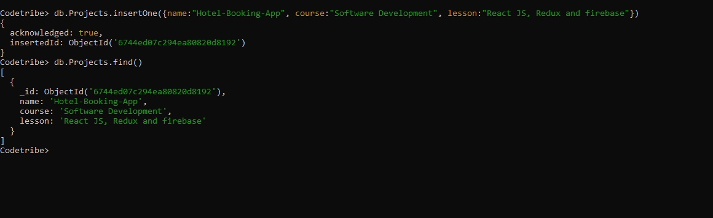

# Codetribe Database using MongoDB

This project demonstrates the use of MongoDB shell (`mongosh`) to create and manage a database named **Codetribe**. The database includes three collections: **Facilitators**, **Trainees**, and **Projects**. Each collection is populated with initial data.

## Features

1. **Database Name**: Codetribe  
2. **Collections**:
   - Facilitators: Stores details about facilitators.
   - Trainees: Stores information about trainees.
   - Projects: Stores project-related details.
3. **Commands Included**:
   - Creating databases.
   - Creating collections.
   - Inserting documents into collections.

---

## Installation and Setup

### Prerequisites
1. Install MongoDB on your system. [Download MongoDB](https://www.mongodb.com/try/download/community).
2. Ensure `mongosh` is installed and accessible via your terminal.
3. Start the MongoDB server:
   ```bash
   mongod
   ```

### Starting MongoDB Shell
1. Open your terminal and type:
   ```bash
   mongosh
   ```

2. Verify connection to MongoDB by listing databases:
   ```bash
   show dbs
   ```

---

## Step-by-Step Guide

### 1. Create the Database
Switch to the **Codetribe** database. If it does not exist, MongoDB will create it upon inserting data.
```bash
use Codetribe
```

### 2. Create Collections and Insert Data
#### a. **Facilitators Collection**
1. Create the `Facilitators` collection and insert a document:
   ```bash
   db.Facilitators.insertOne({
       Name: "John Doe",
       Location: "Johannesburg",
       Course: "Web Development"
   })
   ```

2. Verify the insertion:
   ```bash
   db.Facilitators.find().pretty()
   ```

#### b. **Trainees Collection**
1. Create the `Trainees` collection and insert a document:
   ```bash
   db.Trainees.insertOne({
       Name: "Jane Smith",
       Location: "Cape Town",
       Facilitator: "John Doe"
   })
   ```

2. Verify the insertion:
   ```bash
   db.Trainees.find().pretty()
   ```

#### c. **Projects Collection**
1. Create the `Projects` collection and insert a document:
   ```bash
   db.Projects.insertOne({
       Name: "E-commerce Website",
       Course: "Web Development",
       Lesson: "Building RESTful APIs"
   })
   ```

2. Verify the insertion:
   ```bash
   db.Projects.find().pretty()
   ```

---

## Important MongoDB Shell Commands

1. **Show Databases**:
   ```bash
   show dbs
   ```

2. **Switch to a Database**:
   ```bash
   use <database_name>
   ```

3. **List Collections in a Database**:
   ```bash
   show collections
   ```

4. **Insert Data into a Collection**:
   ```bash
   db.<collection_name>.insertOne({ key: value, key2: value2 })
   ```

5. **View All Data in a Collection**:
   ```bash
   db.<collection_name>.find().pretty()
   ```

6. **Delete a Database**:
   ```bash
   use <database_name>
   db.dropDatabase()
   ```

---

## Verification

To ensure the database and collections are correctly set up:
1. List all databases:
   ```bash
   show dbs
   ```
   Ensure `Codetribe` appears in the list.

2. Switch to the `Codetribe` database:
   ```bash
   use Codetribe
   ```

3. List all collections:
   ```bash
   show collections
   ```

4. Display the documents in each collection:
   - Facilitators:
     ```bash
     db.Facilitators.find().pretty()
     ```
   - Trainees:
     ```bash
     db.Trainees.find().pretty()
     ```
   - Projects:
     ```bash
     db.Projects.find().pretty()
     ```

---

## Images

  



---

